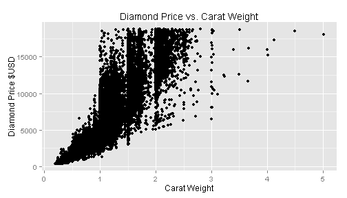

### The Four C's of Diamonds

The four characteristics of diamonds--colo, cut, clarity, and carat--account for approximately 92% of the valuation and were used to construct a pricing model that allows a user to select the characteristcs of a preferred diamond and calcularte the value.  Please see http://www.diamondse.info/ for more information

Data from the "diamonds" data set that comes with ggplot2 library was used to create the model...

Three of the variables are ordered factors:

- Color is graded on a letter scale beginning with A, which designates abolute lack of color, and extending in theory to Z.  This data set contains diamonds with colors ranging from D to J.

- Cut reflects the quality of the cut and how the diamond reflects light; "Ideal" is the highest grade of cut in the data set

- Clarity is a quality grade that represents how light passes through the diamond; the fewer inclusions and irregularities in the crystal structure, the higher the grade.  The highest grade in the dataset is IF (Ideal Flawless) to the lowest I1.

- Carat Weight: Most of the variation in price is caused by the weight ("size") of the diamond measured in carats.  Larger diamonds are more rare and due to the consumer demand for certain diamonds, there are often some non-linear changes in demand as the weight crosses integer thresholds of carat weight.


--- .class #id 

##### Exploratory Analysis

Relationship of Price to Carat Weight: the relationship is roughly linear with larger sized diamonds (few in number) with weights above 3 carats showing as outliers from the main group of diamonds.  There are a total of 53,940 diamonds in the dataset.


```r
require(ggplot2)
```

```
## Loading required package: ggplot2
```

```r
g <- ggplot(diamonds, aes( x = carat, y = price)) + geom_point()
g <- g + labs(x = "Carat Weight", y = "Diamond Price $USD", title = "Diamond Price vs. Carat Weight") 
print(g)
```



--- .class #id 

###### Adjust for Factored Items: Color, Clarity, and Cut
However, if one adjusts for color and clarity, the next two most significant variables, the linear relationship is more pronounced. The points are colored by "cut" the least significant variable of the four.

```r
g2 <- ggplot(diamonds, aes( x = carat, y = price)) + geom_point(aes(color = cut)) +
labs(x = "Carat Weight", y = "Diamond Price $USD", 
title = "Diamond Price vs. Carat Weight") + facet_grid(clarity~color); print(g2)
```


--- .class #id

##### Build Pricing Model

A GLM model was fitted to the data and used to predict diamond values for user selected characteristics using a shiny application.      https://bhill-10.shinyapps.io/Data_Products_Course_Project


```r
library(caret)
```

```
## Loading required package: lattice
```

```r
vars <- diamonds[,1:4]
vars$price <- diamonds$price
price_estimate <- train(price ~., data = vars, method = "glm")
```

```
Generalized Linear Model:
53940 samples
4 predictor

No pre-processing
Resampling: Bootstrapped (25 reps) 
Summary of sample sizes: 
53940,  53940, 53940, 53940, 53940, 53940, ... 

Resampling results
        RMSE      Rsquared   RMSE SD   Rsquared SD
        1156.655  0.9159408  10.27676  0.001223235
```

